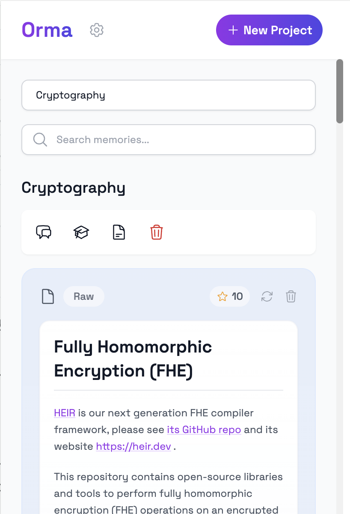

# Orma: Your Digital Memory, Reimagined

<div align="center">
  
  <p><em>Think Different. Remember Everything.</em></p>
</div>

I believe that technology should enhance our natural abilities, not replace them. That's why I created **Orma** (ഓര്‍മ്മ, meaning "Memory" in Malayalam) – a revolutionary browser extension that transforms how you capture, understand, and interact with information online.

## A Magical Experience

Orma isn't just another note-taking tool. It's a beautifully crafted digital memory companion that works the way your brain does. Every interaction is thoughtfully designed to feel natural and effortless. 

<div align="center">
  
</div>

It empowers you and the LLM tools like ChatGPT or Claude you use everyday as well, by providing memories that are both meaningful and contextual.

### Features That Matter

- **Instant Memory Capture**: One click to save anything. It's that simple.
- **AI-Powered Understanding**: Your memories are automatically processed, organized, and connected – like magic.
- **Beautiful Real-time Updates**: Every operation is a delightful experience with smooth animations and clear feedback.
- **Intelligent Search**: Find exactly what you need, even if you don't remember the exact words.
- **Project Workspaces**: Group related memories together, naturally.
- **Interactive Conversations**: Chat with your memories as if they were a knowledgeable friend.
- **Smart Summaries**: Transform your project memories into beautifully structured study notes and even export as markdown files with one click.
- **Knowledge Reinforcement**: Test your understanding through intelligent quizzes.

## Getting Started in Minutes

1. **Install Dependencies**
   ```bash
   npm install
   ```

2. **Build with One Command**
   ```bash
   npm run build
   ```

3. **Add to Chrome**
   - Open Chrome Extensions (`chrome://extensions/`)
   - Enable Developer mode
   - Click "Load unpacked"
   - Select the `dist` directory

## The Technology Behind the Magic

I've carefully chosen each piece of technology to create an experience that's both powerful and elegant:

- React 18 with TailwindCSS for a responsive, native-feeling interface
- Google Nano AI(Chrome Built-in AI) for lightning-fast processing
- Vector search for intelligent memory connections, powered by OpenAI Embeddings
- IndexedDB via Dexie for reliable, offline-capable storage acting as the powerful vector storage

## One More Thing...

Orma is designed to work with your favorite AI tools. Generate perfect context for ChatGPT, Claude, or any other AI assistant. It's like having a team of AI experts working together to enhance your memory.

## Ready to Transform Your Digital Memory?

To unlock all of Orma's capabilities:

1. Open Orma in Chrome
2. Visit Settings
3. Enter your OpenAI API key
4. Start remembering everything

## License

This project is licensed under the MIT License - see the [LICENSE](LICENSE) file for details.

---

<div align="center">
  <p><em>Orma is crafted with ❤️ for those who believe in the power of human memory enhanced by AI.</em></p>
</div>
